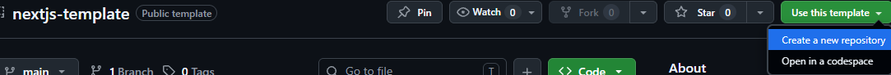

# Dockerized Next.js Template

ホスト環境に Node.js をインストールせず、Docker コンテナ上で React / Next.js プロジェクトを開発するための GitHub テンプレートリポジトリです。

## 想定環境

- Windows + Docker Desktop
- Git
- GitHub アカウント
- GitHub CLI（CLI からリポジトリを作成する場合のみ）

ホスト環境に Node.js がインストールされていても利用できます。

## このテンプレートから新しいプロジェクトを作る

1. このリポジトリの **Use this template** から **Create a new repository** を選択する

2. 新しいリポジトリの所有者、名前、公開範囲を指定して作成する
3. 作成した新しいリポジトリを clone する

```bash
git clone https://github.com/<owner>/<new-repository>.git
cd <new-repository>
```

GitHub CLI を利用する場合は、作成と clone を一度に実行できます。`--private` は必要に応じて `--public` に変更してください。

```bash
gh repo create <owner>/<new-repository> --template situlyu93/nextjs-template --private --clone
```

> [!IMPORTANT]
> 新しいプロジェクトを作る目的で、このテンプレートリポジトリ自体を直接 clone しないでください。テンプレートの Git 履歴と、このリポジトリを指す `origin` が引き継がれます。このプロジェクトを clone した場合 `remote origin`の変更をしてください。
※このプロジェクトに直接pushはできません。

## 初回起動

Docker Desktop を起動してから、プロジェクトのディレクトリで次を実行します。

```bash
docker compose build
docker compose run --rm app npm ci
docker compose up -d
```

起動後、<http://localhost:3000> を開いてください。

## 作成後の初期設定

テンプレートから作成したプロジェクトでは、次の内容をプロジェクトに合わせて変更してください。

- `package.json` と `package-lock.json` のパッケージ名
- `src/app/page.tsx` のサンプル画面
- この README のタイトル、概要、セットアップ手順など

## npm パッケージの追加

app コンテナが起動している場合:

```bash
docker compose exec app npm install <package-name>
```

app コンテナが起動していない場合:

```bash
docker compose run --rm app npm install <package-name>
```

追加したパッケージが開発サーバーへ反映されない場合は、app コンテナを再起動します。

```bash
docker compose restart app
```

## Next.js のアップグレード・ダウングレード

### アップグレード

app コンテナが起動している場合は、Next.js のアップグレードコマンドを実行します。

```bash
docker compose exec app npx next upgrade
```

app コンテナが起動していない場合:

```bash
docker compose run --rm app npx next upgrade
```

手動で最新版へ更新する場合:

```bash
docker compose exec app npm install next@latest react@latest react-dom@latest
docker compose exec app npm install -D eslint-config-next@latest @types/react@latest @types/react-dom@latest
```

### ダウングレード

ダウングレードでは Next.js だけでなく、React、型定義、`eslint-config-next` も互換性のあるバージョンへそろえます。例えば、Next.js 15 / React 19 へ変更する場合は次のように実行します。

```bash
docker compose exec app npm install next@15 react@19 react-dom@19
docker compose exec app npm install -D eslint-config-next@15 @types/react@19 @types/react-dom@19
```

インストールによって `package.json` と `package-lock.json` が更新されます。実際に採用するバージョンは、対象となる Next.js のリリース情報と対応する React のバージョンを確認して決定してください。

アップグレード、ダウングレードのどちらでも、メジャーバージョンを変更すると破壊的変更の影響を受ける可能性があります。変更後は lint とビルドを実行します。

```bash
docker compose stop app
docker compose run --rm app npm run lint
docker compose run --rm app npm run build
docker compose up -d
```

## PC の負荷が重い場合

`compose.yaml` の `WATCHPACK_POLLING` を大きくすると、ファイル変更の確認頻度を下げられます。その代わり、変更の反映は遅くなります。

```yaml
environment:
  # ポーリング間隔（ミリ秒）
  WATCHPACK_POLLING: "500"
```

変更後、app コンテナを再起動してください。

```bash
docker compose restart app
```

## 終了

コンテナとネットワークを削除する場合:

```bash
docker compose down --remove-orphans
```

コンテナ、ネットワーク、Compose がビルドしたイメージを削除する場合:

```bash
docker compose down --rmi local --remove-orphans
```

## 2 回目以降の起動

```bash
docker compose up -d
```

`Dockerfile` や依存関係が変更されている場合は、必要に応じてイメージの再ビルドや `npm ci` も実行してください。

## このテンプレート自体を変更する場合

テンプレートリポジトリの保守・改善が目的の場合に限り、このリポジトリを直接 clone します。

```bash
git clone https://github.com/situlyu93/nextjs-template.git
cd nextjs-template
```

過去の変更内容や変更理由は [`MEMO/`](./MEMO/) を参照してください。
